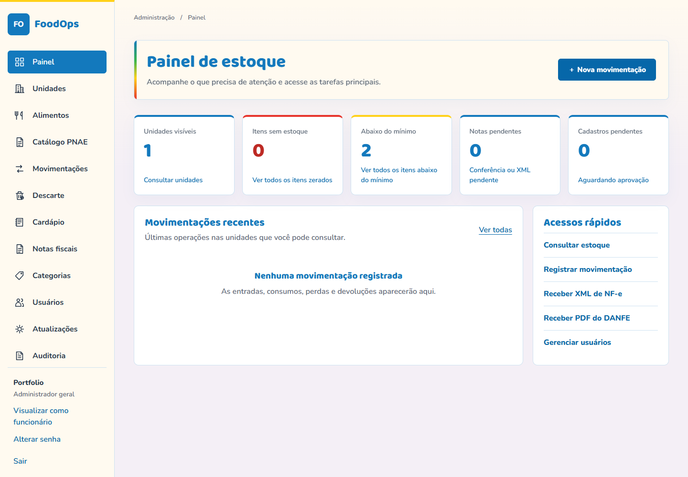
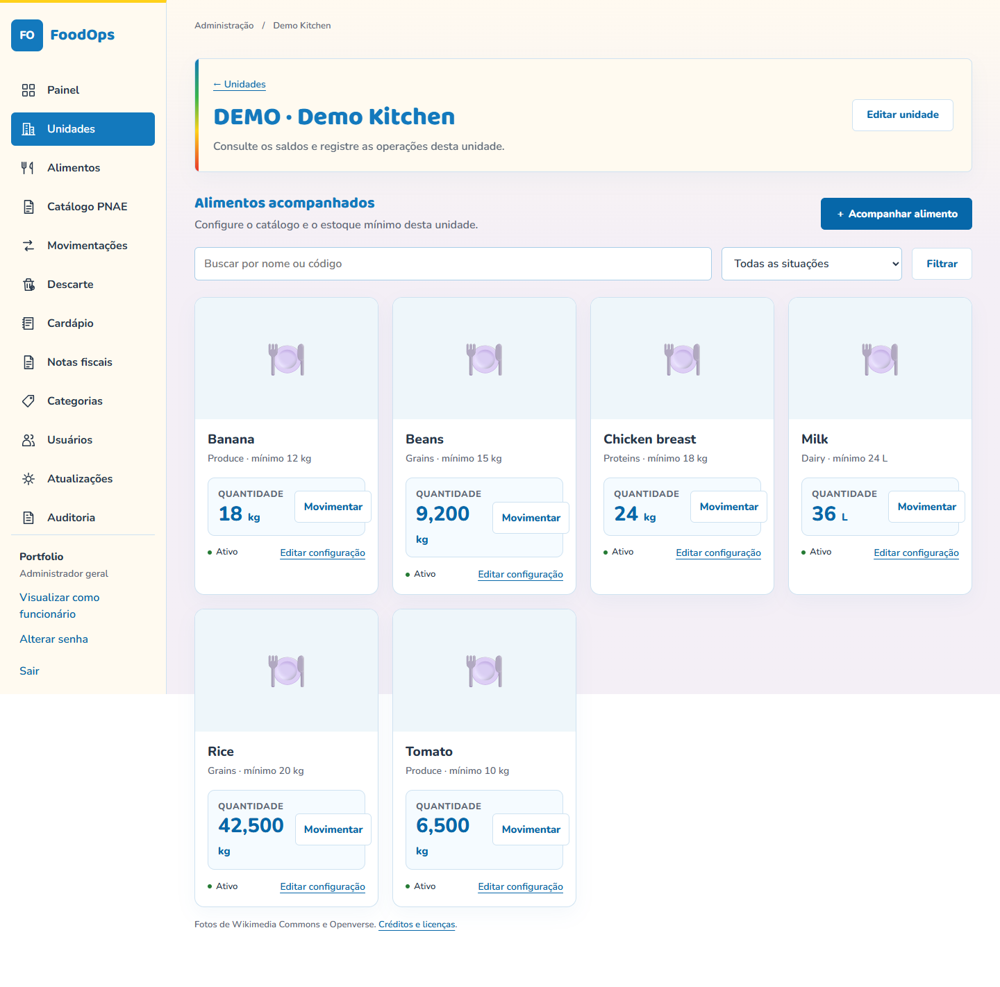
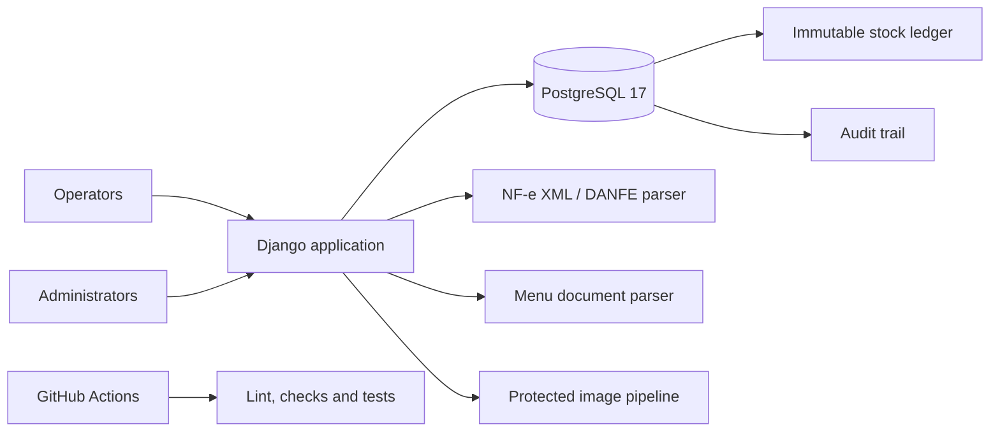

# Food Inventory Operations

[](https://github.com/santosgus3dtech/food-inventory-operations/actions/workflows/checks.yml)
[](https://www.djangoproject.com/)
[](https://www.postgresql.org/)

A multi-site food inventory and operations platform for institutional meal programs. The system
combines stock control, invoice intake, menu planning, disposal evidence, role-based access and an
immutable audit trail in one responsive Django application.

The interface is intentionally written in Brazilian Portuguese for its target operators. This
repository is a sanitized portfolio edition: it contains no real organization name, users,
addresses, invoices, credentials, production domain, database or private documents.

## Screenshots





The screenshots were generated from an isolated local database containing only synthetic units,
foods, quantities and users.

## Product scope

- Multi-site inventory with categories, foods, packages and minimum stock levels.
- Atomic stock entries, consumption, losses, returns, adjustments and reversals.
- NF-e XML validation, duplicate prevention and item-to-food matching.
- DANFE PDF intake with access controls and deferred XML reconciliation.
- Distribution matrix for splitting one invoice across multiple units.
- PNAE catalog checks and approval workflow for justified exceptions.
- Price history normalized by kilogram, liter or unit.
- Weekly menu planning from uploaded documents.
- Disposal records with protected photo evidence.
- User approval, unit-scoped permissions and administrator preview mode.
- Search, filters, pagination and mobile layouts for repeated operational use.
- Immutable application audit records backed by PostgreSQL triggers.

## Architecture



Stock changes are never represented only by a mutable balance. Each operation creates a ledger
entry and updates the current quantity inside one database transaction. Reversals create a new
compensating event, preserving history and accountability.

## Engineering highlights

- Django 5.2 with a custom user model and explicit role boundaries.
- PostgreSQL constraints, row locking and triggers for audit integrity.
- Defensive XML parsing with `defusedxml` and strict upload limits.
- Invoice deduplication by access key and content hash.
- Transactional distribution of invoice items across units.
- Image validation, EXIF normalization, size limits and protected delivery.
- Argon2 passwords, login throttling, session controls and forced password rotation.
- Base-path support for reverse-proxy deployment below a URL prefix.
- WhiteNoise static delivery and hardened container configuration.
- CI for linting, formatting, Django checks, migration drift and test coverage.

## Stack

`Python 3.13+` · `Django 5.2` · `PostgreSQL 17` · `psycopg` · `Docker Compose` ·
`uv` · `Ruff` · `WhiteNoise` · `Gunicorn` · `defusedxml` · `pypdf` · `pdfplumber`

## Run locally

Requirements:

- Python 3.13 or 3.14
- [uv](https://docs.astral.sh/uv/)
- Docker Desktop or Docker Engine with Compose

```powershell
uv sync --locked
uv run python scripts/configurar_local.py
docker compose up -d --wait
uv run python manage.py migrate
uv run python manage.py preparar_local
uv run python manage.py runserver 127.0.0.1:8000 --noreload
```

Open <http://127.0.0.1:8000>. The setup command generates local secrets and a temporary
administrator credential under `.local/`; both locations are ignored by Git.

No production or client data is included. Create sample units and foods through the application
before exercising the workflows.

## Quality checks

```powershell
uv run ruff check .
uv run ruff format --check .
uv run python manage.py check
uv run python manage.py makemigrations --check --dry-run
uv run python manage.py collectstatic --noinput
uv run python manage.py test
```

The test suite covers permissions, stock invariants, reversals, audit protection, NF-e matching,
invoice distribution, image handling, menu workflows, registration and security controls.

## Privacy and security

The private operational system keeps invoice XML, PDFs, user records, unit data, uploaded photos,
credentials and database state outside source control. The public edition follows the same rule.

Before deploying a fork:

1. create unique database and Django secrets;
2. run with `DJANGO_DEBUG=0`;
3. configure explicit hosts and CSRF origins;
4. terminate HTTPS at a trusted proxy;
5. isolate PostgreSQL from the public network;
6. implement external encrypted backups and test restoration;
7. define a retention policy for fiscal documents and photo evidence.

Read [`docs/ARCHITECTURE.md`](docs/ARCHITECTURE.md) and
[`docs/SECURITY.md`](docs/SECURITY.md) for design details.

## Repository map

```text
config/       Django settings, URLs and WSGI entry point
core/         Domain models, services, parsers, views and tests
templates/    Responsive server-rendered interface
static/       Styles, scripts, fonts and attributed food images
deploy/       Container image and database initialization
scripts/      Local setup and startup helpers
docs/         Architecture and security notes
```

Food reference images are sourced from Wikimedia Commons and Openverse. Attribution and license
details are preserved in `static/foods/credits.json`.

## License

MIT License. See [`LICENSE`](LICENSE). Third-party image and font licenses remain governed by their
respective attribution files.
